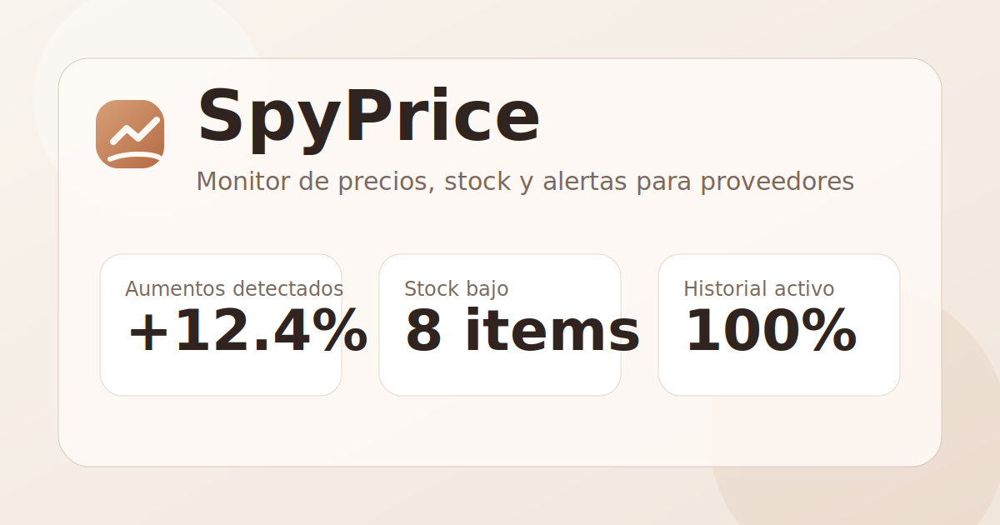

# SpyPrice

Monitor de precios para proveedores pensado como proyecto de portfolio serio: carga de productos, historial real de precios, alertas visuales, stock bajo, backend en FastAPI y despliegue simple con Docker.


## Demo en vivo

| Recurso | URL |
|---|---|
| **App (frontend)** | [spyprice-front.onrender.com](https://spyprice-front.onrender.com) |
| **API (Swagger)** | [spyprice-back.onrender.com/docs](https://spyprice-back.onrender.com/docs) |
| **Repositorio** | [github.com/gabibertero/SpyPrice](https://github.com/gabibertero/SpyPrice) |

La demo corre en Render (plan free). La primera carga puede tardar ~30–60 s mientras despiertan los servicios; después responde normal.



**Qué probar en la demo**

- revisar el tablero con productos de ejemplo y el semaforo de precios
- filtrar por proveedor, categoria o estado
- editar un producto o actualizar un precio y ver el historial
- abrir el panel de atencion (aumentos, stock bajo, estables)

## Que hace

- registra productos con proveedor, categoria, stock y ultima reposicion
- calcula variacion de precio contra historial real
- aplica un semaforo claro:
  - `Estable`: el precio se mantuvo o bajo
  - `Atencion`: el precio subio hasta 10 %
  - `Critico`: el precio subio mas de 10 %
- conserva historial de cada cambio de precio
- permite editar datos del producto sin romper la trazabilidad del precio
- muestra prioridades del dia: aumentos, stock bajo y productos para revisar
- puede enviar un resumen por email si se configuran variables SMTP

## Stack

- Frontend: React + Vite
- Backend: FastAPI + SQLAlchemy
- Base de datos: SQLite
- Testing: Vitest + Pytest
- Deploy: Docker + Docker Compose + Render

## Estado del proyecto

Todas las fases planteadas en el repo quedaron cubiertas en una version funcional y presentable:

- `Fase 0-1`: estructura y UI base
- `Fase 2`: validaciones, estados de carga/error/exito, filtros y logica del semaforo
- `Fase 3-5`: modelo de datos, API, persistencia SQLite e historial de precios
- `Fase 6-8`: integracion frontend/backend, reglas de negocio y reporte SMTP opcional
- `Fase 9-11`: pulido visual, accesibilidad basica, tests, env vars, Docker y documentacion

## Estructura

```text
SpyPrice/
├─ backend/
│  ├─ app/
│  │  ├─ routers/
│  │  ├─ services/
│  │  ├─ database.py
│  │  ├─ main.py
│  │  ├─ migrations.py
│  │  ├─ models.py
│  │  ├─ schemas.py
│  │  └─ settings.py
│  ├─ tests/
│  ├─ requirements.txt
│  └─ Dockerfile
├─ frontend/
│  ├─ public/
│  ├─ src/
│  │  ├─ components/
│  │  ├─ services/
│  │  └─ utils/
│  ├─ package.json
│  └─ Dockerfile
└─ docker-compose.yml
```

## Modelo de negocio

Cada producto guarda:

- `supplier`
- `name`
- `category`
- `current_price`
- `stock`
- `last_restock`

Cada actualizacion de precio genera un registro en `price_history`. El precio anterior no se guarda como campo aislado: se deriva del historial, que es lo que mantiene coherencia de negocio y hace defendible el diseno en entrevista.

## API principal

### Productos

- `GET /api/products`
- `POST /api/products`
- `PUT /api/products/{product_id}`
- `PATCH /api/products/{product_id}/price`
- `DELETE /api/products/{product_id}`
- `GET /api/products/{product_id}/history`

### Alertas

- `GET /api/alerts/summary`
- `POST /api/alerts/send`

### Salud

- `GET /api/health`

La documentacion interactiva queda en `http://localhost:8000/docs`.

## Variables de entorno

### Backend

Tomar como base [`backend/.env.example`](./backend/.env.example).

Variables mas importantes:

- `SPYPRICE_DATABASE_URL`
- `SPYPRICE_CORS_ORIGINS`
- `SPYPRICE_ENABLE_SEED`
- `SPYPRICE_SMTP_HOST`
- `SPYPRICE_SMTP_PORT`
- `SPYPRICE_SMTP_USERNAME`
- `SPYPRICE_SMTP_PASSWORD`
- `SPYPRICE_SMTP_FROM`
- `SPYPRICE_SMTP_USE_TLS`
- `SPYPRICE_ALERT_RECIPIENT`

### Frontend

Tomar como base [`frontend/.env.example`](./frontend/.env.example).

- `VITE_API_URL`

## Desarrollo local

### Backend

```bash
cd backend
python -m venv .venv
.venv\Scripts\activate
pip install -r requirements.txt
uvicorn app.main:app --reload
```

### Frontend

```bash
cd frontend
npm install
npm run dev
```

## Tests

### Backend

```bash
cd backend
.venv\Scripts\python -m pytest
```

### Frontend

```bash
cd frontend
npm test
```

## Deploy

### Produccion (Render)

| Servicio | URL |
|---|---|
| Frontend | `https://spyprice-front.onrender.com` |
| Backend | `https://spyprice-back.onrender.com` |
| Swagger | `https://spyprice-back.onrender.com/docs` |

Variables clave en Render:

- **Frontend**: `VITE_API_URL=https://spyprice-back.onrender.com`
- **Backend**: `SPYPRICE_CORS_ORIGINS` debe incluir la URL del frontend
- **Backend**: `SPYPRICE_ENABLE_SEED=true` para datos de demo

### Local con Docker

```bash
docker compose up --build
```

Servicios:

- Frontend: `http://localhost:4173`
- Backend: `http://localhost:8000`
- Swagger: `http://localhost:8000/docs`

## Decisiones tecnicas defendibles

- El semaforo de precios se basa solo en variacion de precio, no en stock, porque el README lo define asi.
- El stock bajo se trata como senal aparte para no mezclar riesgo de margen con riesgo operativo.
- El historial de precios vive en tabla separada para soportar trazabilidad, reportes y futuras graficas.
- El backend expone configuracion por entorno y una migracion liviana para evolucionar el esquema sin meter Alembic antes de tiempo.
- El frontend usa utilidades compartidas para reglas y formato de fechas, evitando bugs tipicos de timezone con `YYYY-MM-DD`.

## Validacion ejecutada

Ultima validacion en este workspace, el `2026-07-07`:

- `npm run build`
- `npm test`
- `.venv\Scripts\python -m pytest`
- smoke test HTTP de alta, edicion, historial, alertas y borrado

## Autor

**Gabriel Bertero**  
Estudiante de Ingenieria en Sistemas, UTN Cordoba  
[GitHub](https://github.com/gabibertero)

## Licencia

Distribuido bajo licencia MIT. Ver [LICENSE](./LICENSE).
